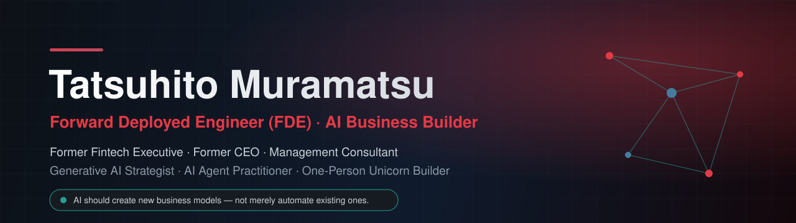
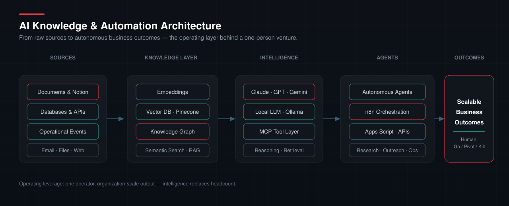

  <a href="./README.md">English</a> | <strong>日本語</strong>

  

<h1 align="center">Tatsuhito Muramatsu</h1>
<h3 align="center">Forward Deployed Engineer（FDE）· AI Business Builder</h3>

  <em>元Fintech経営幹部 · 元CEO · 経営コンサルタント</em>

  <strong>課題発見 → 設計 → 実装 → 本番導入 → 定着</strong> 
  顧客・現場とともに、AIを実際に動く事業と業務へ変える。

  
  
  
  

---

## Mission

> **テクノロジーそのものが目的ではない。意味のある事業課題を解決することが目的である。**
>
> AI、自動化、組織に蓄積された知識を、実際に稼働する仕組みと拡張可能な事業モデルへ変えます。課題発見から設計、実装、本番導入、定着まで一気通貫で担います。

---

## 私が提供すること

私は、顧客の現場、事業戦略、AI実装の交点で活動する **Forward Deployed Engineer（FDE）** です。現場に入り、当事者とともに本当の課題を定義し、解決策が本番環境で使われ成果を生むまで責任を持ちます。

| 領域 | 提供価値 |
|---|---|
| **AI事業開発** | AIネイティブな新規事業、仮説検証、事業・運営モデル、価値創出までの設計 |
| **Forward Deployed AI** | 課題発見、要件定義、アーキテクチャ、実装、評価、本番導入、定着支援 |
| **AIエージェント・自動化** | 人の承認を含み、実際の業務システムと接続されたエンドツーエンドのワークフロー |
| **ナレッジシステム** | RAG、構造化データ、MCP連携による、検索・再利用可能な組織知の構築 |
| **業務変革** | 分断されたExcelや手作業を、権限・履歴・統制を備えたアプリとワークフローへ移行 |

<strong>デモではなく、事業成果まで。</strong>

---

## 経歴

事業戦略、資本、オペレーション、AI実装を横断する事業家です。

20年以上にわたり、**CEOとして250名超の組織を経営**し、Fintech領域では **GMO Payment Gatewayの執行役員**を務めました。また、経営コンサルタントとして、企業変革、M&A、PMI、ASEAN展開を支援してきました。

現在は **Dragon Tech** のもとでAIネイティブ事業を開発・運営しています。曖昧な業務課題を要件に変え、アプリケーションと自動化を自ら実装し、既存システムと接続して本番導入まで進めることが私の役割です。

長期的に追求しているのは「一人ユニコーン」という仮説です。AIは単なる省力化の道具ではありません。少人数、さらには一人でも、これまでにない規模で事業を創り運営できる新しい仕組みを実現するものだと考えています。

---

## AI・自動化の実装領域

<table>
  <tr>
    <td width="50%" valign="top">
      <h3>🤖 AIエージェント</h3>
      <ul>
        <li>調査、分析、文書作成、意思決定支援</li>
        <li>ツール操作、承認、例外処理を含む複数工程の自動化</li>
        <li>重要な業務操作に対するHuman-in-the-loop設計</li>
        <li>再利用できるエージェント手順、評価、運用ルール</li>
      </ul>
    </td>
    <td width="50%" valign="top">
      <h3>🧠 企業ナレッジシステム</h3>
      <ul>
        <li>社内文書・業務データを対象としたRAG</li>
        <li>検索、引用、権限、情報更新フローの設計</li>
        <li>Notion、データベース、文書保管基盤の接続</li>
        <li>MCPによる組織知とAIツールの統合</li>
      </ul>
    </td>
  </tr>
  <tr>
    <td width="50%" valign="top">
      <h3>⚙️ 業務自動化</h3>
      <ul>
        <li>n8n、Webhook、API、イベント駆動型の連携</li>
        <li>Notion CRM・業務データベースの設計</li>
        <li>メール、帳票、問い合わせ、バックオフィス業務の自動化</li>
        <li>Google Workspace・外部SaaSとの統合</li>
      </ul>
    </td>
    <td width="50%" valign="top">
      <h3>🚀 AI業務アプリ</h3>
      <ul>
        <li>Next.js・ReactによるAI搭載業務アプリ</li>
        <li>Supabase・PostgreSQLによる認証とデータ管理</li>
        <li>Cloudflare・Vercelへの本番公開</li>
        <li>テスト、セキュリティ、監視、運用引き継ぎ</li>
      </ul>
    </td>
  </tr>
</table>

---

## 現在の事業

<table>
  <tr>
    <td width="50%" valign="top">
      <h3>🐉 ForestShare</h3>
      
<strong>林業機械のシェアリングプラットフォーム</strong>

      
稼働していない林業機械の時間を生産的な稼働時間へ変え、すでに存在する設備資産から新たな価値を生み出します。

      
 

    </td>
    <td width="50%" valign="top">
      <h3>🩺 CareSync</h3>
      
<strong>医療・介護の業務基盤</strong>

      
組織内に分散した知識と手作業による調整を、共有・検索・自動化できる医療機関向けの業務レイヤーへ変えます。

      
 

    </td>
  </tr>
</table>

---

## 技術スタック

<strong>AIモデル・リサーチ</strong>

  
  
  
  

<strong>エージェント・ナレッジ</strong>

  
  
  
  

<strong>自動化・業務システム</strong>

  
  
  
  

<strong>アプリケーション・データ・公開基盤</strong>

  
  
  
  
  
  

<strong>AI開発環境</strong>

  
  
  
  

---

## 経営・事業領域

| 戦略・経営 | 成長・トランザクション | AI実装 |
|---|---|---|
| 事業戦略 企業変革 DX オペレーション改革 | M&A・PMI ASEAN展開 Go-to-Market Revenue Operations | AI事業設計 Forward Deployed Delivery ナレッジマネジメント 業務自動化 |

---

## GitHub Metrics

  
  

---

## Philosophy

  <em>テクノロジーそのものが目的ではない。意味のある事業課題を解決することが目的である。</em> 
  <strong>AIは既存業務を自動化するだけでなく、まったく新しい事業モデルを生み出すべきだ。</strong>

---

## Contact

投資家、起業家、企業経営者、AIチームとともに、最先端技術を持続的な事業成果へ変えます。

  
  
  

Chief Dragon Officer · Dragon Tech — 人数ではなく、知能で動く事業をつくる。

