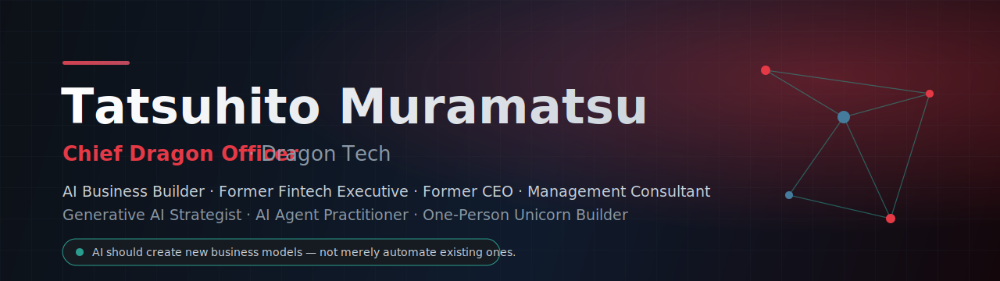
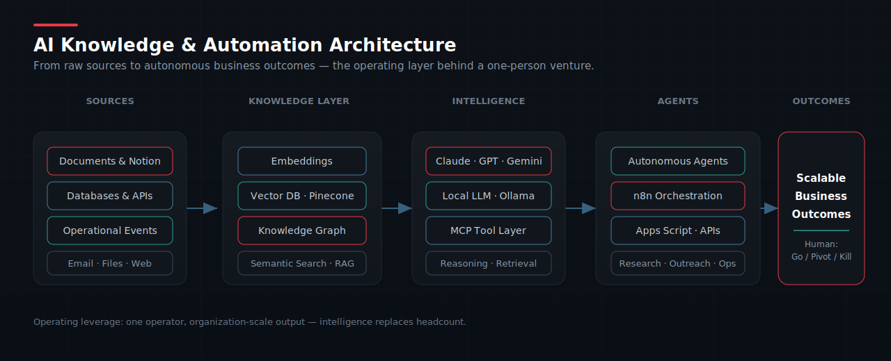

<!-- ════════════════════════════════════════════════════════════════ -->
<!--                          HERO SECTION                            -->
<!-- ════════════════════════════════════════════════════════════════ -->

  

<h1 align="center">Tatsuhito Muramatsu</h1>
<h3 align="center">Chief Dragon Officer · Dragon Tech</h3>

  <em>AI Business Builder · Former Fintech Executive · Former CEO · Management Consultant · One-Person Unicorn Builder</em>

  

  
  
  
  

---

## Mission

> **Technology is not the goal. Solving meaningful business problems is.**
>
> Use AI, automation, and knowledge systems to solve meaningful business problems and create scalable business models — building ventures where one person can operate at the scale of an organization.

---

## About Me

I am a business builder operating at the intersection of strategy, capital, and applied AI.

Over two decades I have led organizations as a **Chief Executive Officer** directing teams of more than **250 employees**, served as an **Executive Officer at GMO Payment Gateway** in fintech, and advised enterprises as a **management consultant** through transformation, M&A, post-merger integration, and ASEAN expansion.

Today I build and operate AI-native ventures under **Dragon Tech**. My focus is the *one-person unicorn* thesis: combining generative AI, autonomous agents, retrieval systems, and end-to-end automation so that a single operator can design, launch, and scale real businesses without the traditional headcount curve.

I work where the operating leverage is highest — converting idle capacity into productive output, codifying expert knowledge into systems that compound, and replacing manual process with autonomous workflows. I care about outcomes that move the income statement, not demos.

---

## Current Focus

<table>
  <tr>
    <td width="50%" valign="top">
      <h3>🐉 ForestShare</h3>
      
<strong>Forestry machinery sharing platform.</strong>

      
Transform idle forestry machinery into productive assets. The core concept is simple and durable: convert non-operating time into operating time, unlocking utilization from capital that already exists.

      

        
        
      

    </td>
    <td width="50%" valign="top">
      <h3>🩺 CareSync</h3>
      
<strong>Healthcare &amp; caregiving operational platform.</strong>

      
Improve operational efficiency and knowledge sharing across healthcare organizations — turning fragmented institutional knowledge and manual coordination into a shared, searchable, automated operating layer.

      

        
        
      

    </td>
  </tr>
  <tr>
    <td width="50%" valign="top">
      <h3>🤖 AI Agents</h3>
      
Designing and operating autonomous agents that execute real business workflows — research, outreach, orchestration, and decision support — under human strategic oversight rather than human labor.

    </td>
    <td width="50%" valign="top">
      <h3>🧠 Knowledge Systems &amp; Automation</h3>
      
RAG pipelines, knowledge graphs, and MCP-connected tooling that turn private expertise into compounding, queryable assets — wired into automation that runs without me.

    </td>
  </tr>
</table>

---

## AI &amp; Technology Ecosystem

<strong>Generative AI</strong>

  
  
  
  
  

<strong>AI Infrastructure</strong>

  
  
  
  
  
  

<strong>Automation &amp; Data</strong>

  
  
  
  
  
  

<strong>Build &amp; Ship</strong>

  
  
  
  

  

---

## Expertise

<table>
  <tr>
    <td align="center" width="33%">
      <h4>Strategy &amp; Leadership</h4>
       
       
       
       
      
       
      
    </td>
    <td align="center" width="33%">
      <h4>Applied AI</h4>
       
       
       
       
       
      
    </td>
    <td align="center" width="33%">
      <h4>Commercial &amp; Finance</h4>
       
       
       
       
      
    </td>
  </tr>
</table>

---

## Featured Projects

<table>
  <tr>
    <td width="50%" valign="top">
      <h3>ForestShare</h3>
      
<strong>Forestry machinery sharing platform</strong>

      <ul>
        <li>Converts non-operating machinery time into revenue-generating operating time</li>
        <li>Asset-light marketplace model over existing capital equipment</li>
        <li>Zero-cost hypothesis-validation sprint before capital deployment</li>
      </ul>
      

        
        
      

    </td>
    <td width="50%" valign="top">
      <h3>CareSync</h3>
      
<strong>Healthcare &amp; caregiving operational platform</strong>

      <ul>
        <li>Operational efficiency layer for healthcare organizations</li>
        <li>Knowledge sharing across teams, sites, and shifts</li>
        <li>Reduces coordination overhead and institutional knowledge loss</li>
      </ul>
      

        
        
      

    </td>
  </tr>
  <tr>
    <td width="50%" valign="top">
      <h3>Enterprise Automation</h3>
      
<strong>Autonomous business workflows</strong>

      <ul>
        <li>n8n, Google Apps Script, and API-integrated orchestration</li>
        <li>AI agents executing research, outreach, and operations</li>
        <li>Human role reduced to strategic Go / Pivot / Kill decisions</li>
      </ul>
      

        
        
      

    </td>
    <td width="50%" valign="top">
      <h3>AI Knowledge Systems</h3>
      
<strong>Compounding institutional intelligence</strong>

      <ul>
        <li>RAG pipelines over private corpora with vector search</li>
        <li>Knowledge graphs and semantic retrieval via MCP</li>
        <li>Local LLM and cloud models for privacy-aware inference</li>
      </ul>
      

        
        
      

    </td>
  </tr>
</table>

---

## GitHub Metrics

  
  

  

  

<!-- Contribution Snake — generated by .github/workflows/snake.yml into the `output` branch -->

  

  

---

## Philosophy

  <em>Technology is not the goal. Solving meaningful business problems is.</em> 
  <strong>AI should create entirely new business models, not merely automate existing processes.</strong>

---

## Contact

  I work with investors, founders, enterprise executives, and AI teams building the next operating layer of business.

  
  
  

  Chief Dragon Officer · Dragon Tech — building businesses that run on intelligence, not headcount.

